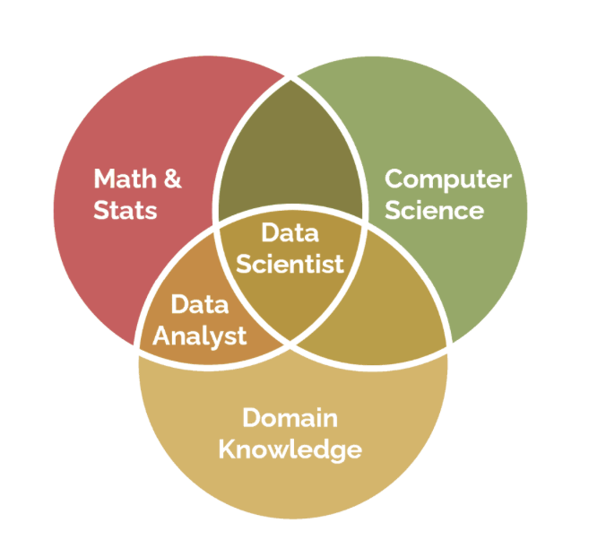
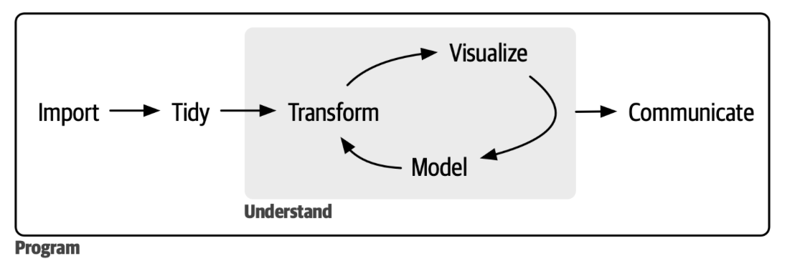
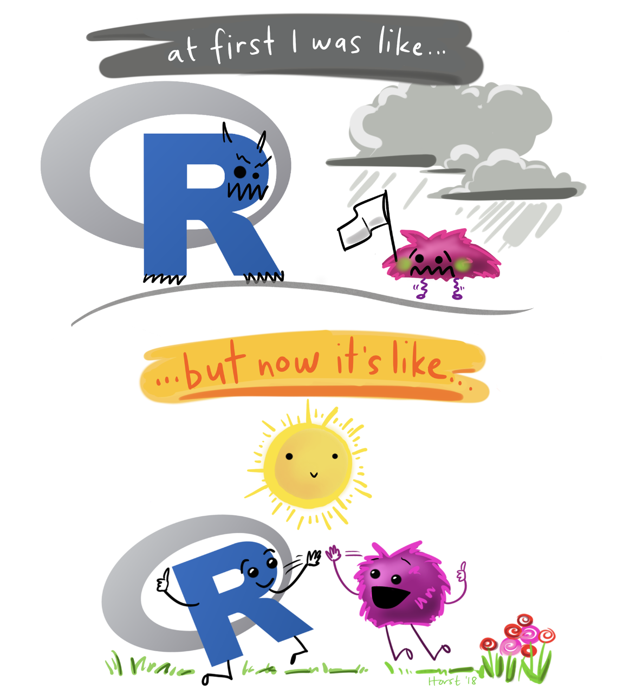
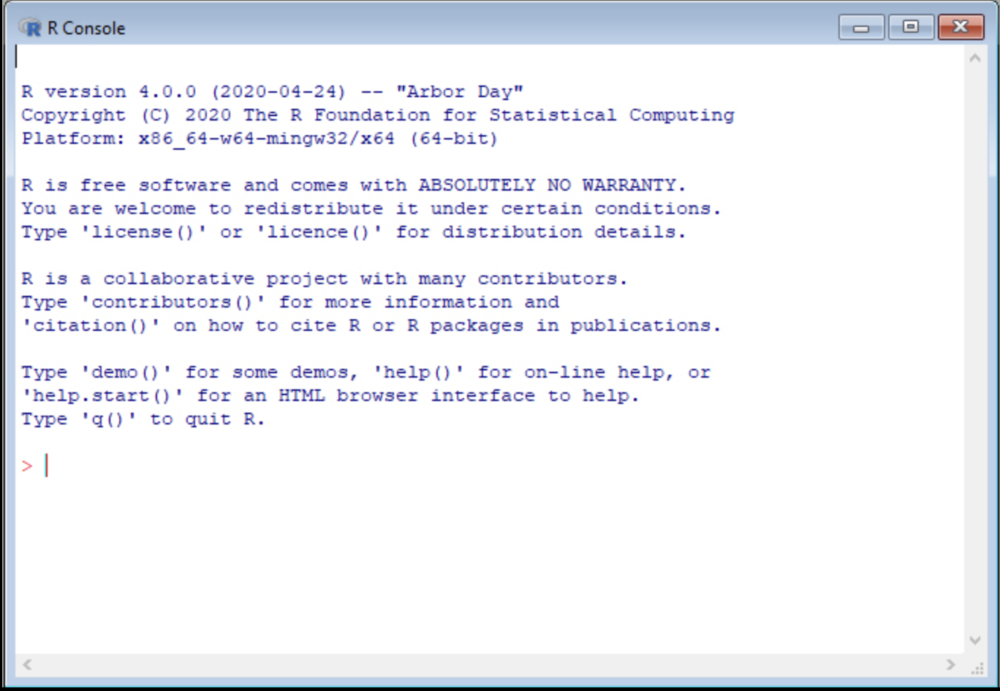

```{r echo=FALSE, message=FALSE, warning = FALSE}
library(tidyverse)
library(knitr)

hook_output = knit_hooks$get('output')
knit_hooks$set(output = function(x, options) {
  # this hook is used only when the linewidth option is not NULL
  if (!is.null(n <- options$linewidth)) {
    x = xfun::split_lines(x)
    # any lines wider than n should be wrapped
    if (any(nchar(x) > n)) x = strwrap(x, width = n)
    x = paste(x, collapse = '\n')
  }
  hook_output(x, options)
})

```

```{r, include = F, eval = T, cache = T}
clean_file_name <- function(x) {
  basename(x) %>% str_remove("\\..*?$") %>% str_remove_all("[^[A-z0-9_]]")
}

img_modal <- function(src, alt = "", id = clean_file_name(src), other = "") {
  
  other_arg <- paste0("'", as.character(other), "'") %>%
    paste(names(other), ., sep = "=") %>%
    paste(collapse = " ")
  
  js <- glue::glue("<script>
        /* Get the modal*/
          var modal{id} = document.getElementById('modal{id}');
        /* Get the image and insert it inside the modal - use its 'alt' text as a caption*/
        var img{id} = document.getElementById('img{id}');
          var modalImg{id} = document.getElementById('imgmodal{id}');
          var captionText{id} = document.getElementById('caption{id}');
          img{id}.onclick = function(){{
            modal{id}.style.display = 'block';
            modalImg{id}.src = this.src;
            captionText{id}.innerHTML = this.alt;
          }}
          /* When the user clicks on the modalImg, close it*/
          modalImg{id}.onclick = function() {{
            modal{id}.style.display = 'none';
          }}
</script>")
  
  html <- glue::glue(
     " <!-- Trigger the Modal -->

<!-- The Modal -->
<div id='modal{id}' class='modal'>
  <!-- Modal Content (The Image) -->
  
  <!-- Modal Caption (Image Text) -->
  <div id='caption{id}' class='modal-caption'></div>
</div>
"
  )
  write(js, file = "js-addins.html", append = T)
  return(html)
}
# Clean the file out at the start of the compilation
write("", file = "js-addins.html")
```
class:inverse

<br><br><br>
## Welcome to DSC365
### DSC365: Intro to Data Science
#### August 18, 2026

---

## Homework

- Software downloaded by beginning of class on **Thursday**
  + Should hopefully have time at end of class


---

## Alex Kunin, PhD

- Too many college degrees
- Computational Neuroscientist, currently interested in neuronal circuitry

**Now introduce yourselves! Get into groups of 2-3**

Talk to each other for a bit, then designate someone to speak on behalf of your group, telling us...
- Your names
- Something your group has in common (besides things like major ...)

---
class:inverse

<br>
<br>
<br>
<br>
<br>
<br>
<br>
<br>
.center[
## What is Data Science?
]


---
### Data Science

Data science is an exciting discipline that allows you to turn raw data into understanding, insight, and knowledge.

- Data science is a vast field, and there’s no way you can master it all by taking a single course. But we are going to lay a solid foundation.

.center[
```{r, echo=FALSE, out.width="60%", fig.alt = "Venn Diagram depicting skills that a good data scientist must have. Data scientists needs skills from math and stats, computer science, and the domain of application"}



```
]


---
### Data Science

.center[
```{r, echo=FALSE, fig.alt = "The Data Science Flow Chart. First you must import the data into your programing language of preference. Next you must clean the data. Then you have a cycle of transforming, visualizing, and modeling your data. Finally once you have answered your research question, you must then communicate your results to a non-statistical audience."}



```
]

---
class:inverse

<br>
<br>
<br>
<br>
<br>
<br>
<br>
<br>
.center[
## Syllabus and Course Specifics
]


---

## What will be in this course?

- This is a programming course using *R*, the most commonly used *statistical* language
- We will briefly cover each part of the Data Science Cycle
- In this course you will complete in-class labs, projects, and presentations.
- Since this course involves using *R*, please bring your laptops to class with you

---

## Syllabus


---
class:inverse

<br>
<br>
<br>
<br>
<br>
<br>
<br>
<br>
.center[
## Software Set-Up
]

---

### How to Learn a Programming Language

If you have never used *R* (or even heard of it) before, it is totally OK! We will be starting with the basics.

.pull-left[
- Breathe
- Mistakes are ok!
- Ask for help!
- Translate code into plain English
- Don't reinvent the wheel
- Walk away

].pull-right[
```{r, echo=FALSE, fig.alt="Cartoon depicting that R can be frustrating to learn at first, but hopefully after some time it becomes more fun to use."}



```
.center[<font size = "0.75">Artwork by Allison Horst</font>]
]

---
### What is R?

*R* is a free software environment and programming language for statistical computing and graphics

- Created by Ross Ihaka and Robert Gentleman in 1993; Formally released by the [**R Core Group**](https://www.r-project.org/contributors.html) in 1997. 
- Open-source
- **Interpreted language**: we interact with R through a “command line” interpreter, which translates our “code” to machine code
- CRAN (comprehensive R archive network) is R's central software repository. Contains contributed packages
- New major release once a year

```{r, echo=FALSE, fig.align='center', out.width="50%", fig.alt = "Visual of the R Console. This is the place where you would type R code."}



```


---
### What is R Studio?

Every R installation comes with the *R* Console, so we don’t actually need an additional program to interface with R. BUT most of people who uses *R* ALSO uses RStudio to interact with it.

- History
  + **RStudio** was released in 2011 by J.J. Allaire.
  + They make money off the IDE and other helper software.
  + In 2020, RStudio became a PBC (*Public Benefit Corp*), meaning they are legally obligated to support education and open-source development.
- “Integrated Development Environment”
  + Clean user interface
  + quality of life features (syntax highlighting, tab completion,etc)

---
### Eventually... Move to Positron

From it's [website](https://positron.posit.co): "Positron unifies exploration and production work in one free, AI-assisted environment, empowering the full spectrum of data science in Python and R"

- Positron is under much more active development, with a rapidly expanding set of features. RStudio’s development, on the other hand, is much more focused on bug fixes and product stability.
- First stable release in July 2025 
  + I have been told there is still some things it needs to work through.


---

### Implication of Open-Source Software

Because *R* is open source...

- No one company owns *R* (similar to Python)
- This means nobody can sell their **R** code!
  + But you can sell "helpers" like **RStudio**.
- Users can contribute *R* packages to add additional functions and capabilities (more than 19,000 as of March 2023). 
  + A complete list can be found [here](https://cran.r-project.org/web/packages/available_packages_by_name.html)
  + Pro: New statistical/data science techniques are added to CRAN, Bioconductor (another package repository), GitHub, etc. daily
  + Con: No standard syntax! Not all are well documented

---

### Reproducible Research

Excerpt from the Simply Statistics blog: “The Real Reason Reproducible Research is Important” [(Source)](https://simplystatistics.org/posts/2014-06-06-the-real-reason-reproducible-research-is-important/)

- **Reproducible**: the original data (and original computer code) can be analyzed (by an independent investigator) to obtain the same results of the original study.
- Reproducibility is important because it is the only thing that an investigator can guarantee about a study.
- It does not necessarily ensure the results are correct, but does ensure transparency.

More reasons to do your programming in a reproducible way:

1. **Time saved**: especially important in the professional world
2. **Time elapsed**: even the best programmers forget how their code runs eventually

---
### Reproducible Research with Quarto

Quarto provides “an authoring framework for data science”. In an Quarto document, you can:

- Save and execute code
- Generate written reports that can be shared with someone else
- Supported file formats: Word, PDF, HTML, slide shows, handouts, dashboards, Powerpoint

<br>
<br>
**More on this next week**

---
### Let's Install it Together

1. Download and run the R installer for your operating system from CRAN
  - Windows: https://cran.rstudio.com/bin/windows/base/
  - Mac: https://cran.rstudio.com/bin/macosx/
  - Linux: https://cran.rstudio.com/bin/linux/
2. Now download RStudio from the RStudio website – IDE of R
 - https://posit.co/download/rstudio-desktop/
3. If you are using a Mac, you may need to download XQuartz.
https://www.xquartz.org/
 - If you run into issues, try downloading this to see if it helps.


Go with all default options

<br>
<br>

**Other Option**: If you would prefer to not download it to your computer: https://posit.cloud


---
### R Studio Set-Up

```{r, echo=FALSE, out.width="100%", fig.align='center', fig.alt = "Picture of the R Studio Interface. The top left is called the script and it is where you can write your code. You can save your script to access the code later. The bottom left is the Console which looks idential to base R. This is where you will see your outputs. The top right is the enviroment tab where you will see all the data you import and any created objects. The bottom right is where plots will appear and you can find a list of downloaded packages."}

knitr::include_graphics("./images/rstudio.png")

```

To Create a Script, Click the Following: File -> New File -> R script

---
### R Studio Set-Up - Editor (Top Left)

```{r, echo=FALSE, out.width="90%", fig.align='center', fig.alt= "Zoomed in view of the Editor window, where the user can write and save code. Highlighted in the top right of the picture is the Run button, which runs the line of code your cursor is placed on."}

knitr::include_graphics("./images/editor.jpeg")

```

<br>

**Shortcuts for running code**: To run code from your script:
+ Windows: Ctrl + Enter
+ Mac: Cmd + Enter

---
### R Studio Set-Up - Console (Bottom Left)

```{r, echo=FALSE, out.width="100%", fig.align='center', fig.alt= "Zoomed in view of the console window. Code output will appear at the bottom of this window."}

knitr::include_graphics("./images/console.jpeg")

```

---
### R Studio Set-Up - Environment  (Top Right)

```{r, echo=FALSE, out.width="100%", fig.align='center', fig.alt="Zoomed in view of the Environment tab, where loaded in datasets will appear ready for use. Highlighed are the buttons that are helpful. The import dataset button offers a point-and-click method to load in a dataset. Additionally, the broom button will clear the environment."}

knitr::include_graphics("./images/environment.jpeg")

```

---
### R Studio Set-Up - Environment  (Bottom Right)

```{r, results='asis', echo=FALSE, fig.align='center'}

i1 <- img_modal(src = "./images/files.png", alt = "Files",other=list(width="30%"))
i2 <- img_modal(src = "./images/packages.png", alt = "Packages",other=list(width="30%"))
i3 <- img_modal(src = "./images/help.png", alt = "Help",other=list(width="30%"))

c(str_split(i1, "\\n", simplify = T)[1:2],
  str_split(i2, "\\n", simplify = T)[1:2],
  str_split(i3, "\\n", simplify = T)[1:2],
  str_split(i1, "\\n", simplify = T)[3:9],
  str_split(i2, "\\n", simplify = T)[3:9],
  str_split(i3, "\\n", simplify = T)[3:9]
  ) %>% paste(collapse = "\n") %>% cat()

```
